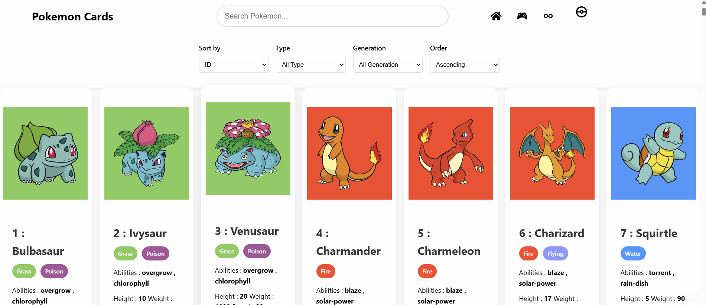

# Pokemon decks 2.0

## Introduction

This is a pokemon website , which is developed using react

## Features

- Pokemon Cards
- Pokemon Game
- Background changing theme - color palette
- Search Bar
- Sorting

## Requirements

- Nodejs installed
- React
- Vite

## Output

> [!Note]
> This is the website of the code please check it out , if found any bugs inform it to me https://pokemon-decks-2o.netlify.app/
